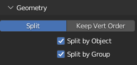

# modelbin-tool
This tool converts the .modelbin format to Wavefront obj.  
<<<<<<< HEAD
>Usage: `python modelbin.py <input file>`
>Example: `python modelbin.py hood.modelbin`
>*Outputs to **out.obj***  
=======
>Usage: `python modelbin.py <input file>`  
>Example: `python modelbin.py hood.modelbin`  
>*Outputs to **out.obj***
>>>>>>> bbc193661b87aa67061e5fbc6bf956bf80a7be46

Make sure to split model by group when importing.  
Example for Blender:  

### **TODO**:
- Vertex positions ✓
- Face indices ✓
- Correct scaling
- Grouping ✓
- UVs
- Materials
- etc.
